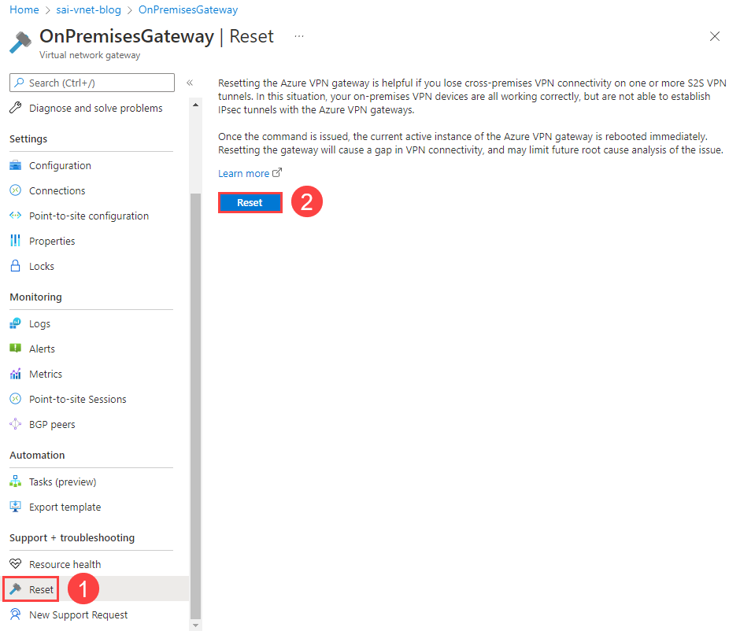
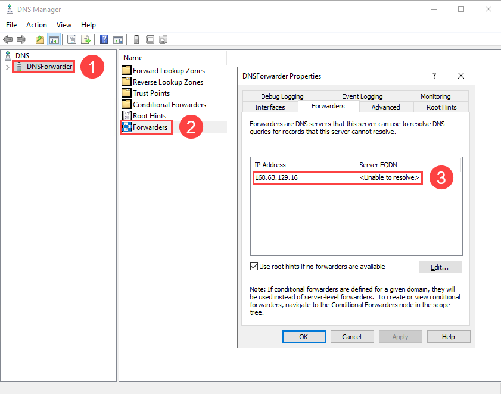
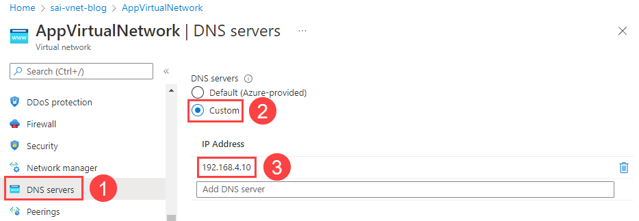
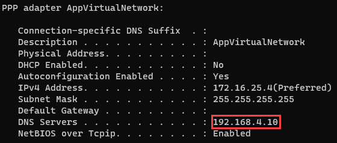
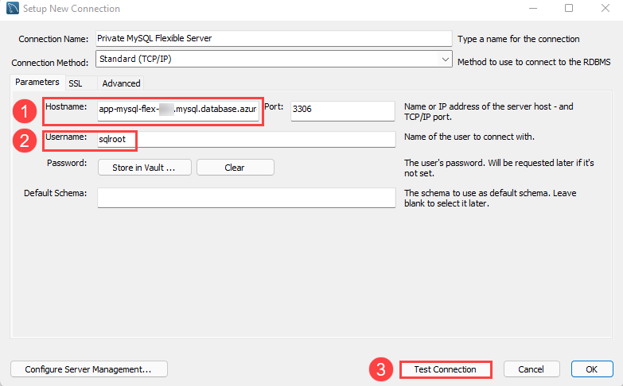
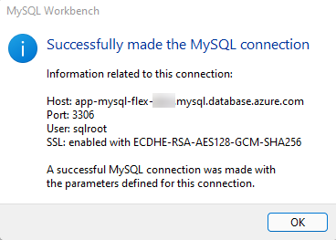

# Accessing MySQL Flexible Server in a Virtual Network from On-Premises

## The Challenge

Azure Database for MySQL Flexible Server, one of Microsoft's PaaS MySQL offerings, supports a native virtual network deployment to avoid data exfiltration and meet industry compliance requirements. Moreover, Azure VPN Gateway Point-to-Site connections are popular to facilitate communication with resources located in an Azure virtual network from on-premises workstations. By default, MySQL Flexible Server is accessible from on-premises through its private IP address, but not its DNS name. This post demonstrates that a low-cost Windows Server 2019 VM can serve as a DNS forwarder for on-premises workstations accessing MySQL Flexible Server in a virtual network through its DNS name.  

### How does Flexible Server Name Resolution Work?

The ARM template provisions an Azure *private DNS zone* that is attached to the application virtual network. Azure private DNS zones typically eliminate the need for a custom DNS solution to access Flexible Server through a DNS name. However, records in a private DNS zone cannot be resolved from on-premises.

The solution is to utilize a virtual machine as a DNS forwarder. The virtual machine is configured as the DNS server for the virtual network, and clients on that network, including on-premises resources connecting through VPN, will use that virtual machine for name resolution. Azure provides the virtual public IP address of `168.63.129.16` to, [among other purposes](https://docs.microsoft.com/azure/virtual-network/what-is-ip-address-168-63-129-16), resolve DNS lookups from private DNS zones. The VM DNS service will forward requests to that virtual public IP.

### Resources

This post assumes the following fundamental knowledge:

#### Networking

- [Overview of Azure Virtual Networking](https://docs.microsoft.com/azure/virtual-network/virtual-networks-overview)
- [Overview of Azure VPN Gateway](https://docs.microsoft.com/azure/vpn-gateway/vpn-gateway-about-vpngateways)
- [Overview of Azure VPN Gateway Point-to-Site Connections](https://docs.microsoft.com/azure/vpn-gateway/point-to-site-about)

#### Azure Database for MySQL (Flexible Server)

- [Overview of Azure Database for MySQL - Flexible Server](https://docs.microsoft.com/azure/mysql/flexible-server/overview)
- [Overview of Private Network Access for Azure Database for MySQL - Flexible Server](https://docs.microsoft.com/azure/mysql/flexible-server/concepts-networking-vnet)

## Configuration Steps

### ARM Template

The ARM template provided with this post will provision Azure Database for MySQL Flexible Server in a virtual network; a VPN Gateway to connect to the virtual network from on-premises; and a Virtual Machine, which will function as a DNS forwarder.

### Connect to VPN Gateway from On-Premises

Follow the steps in [this Microsoft TechCommunity post](https://techcommunity.microsoft.com/t5/itops-talk-blog/step-by-step-creating-an-azure-point-to-site-vpn/ba-p/326264) to generate a certificate pair for VPN Gateway, modify the **Point-to-site configuration**, and download the Azure VPN client.

Note that if you encounter issues connecting from your client machine, you may need to **Reset** the VPN Gateway after making configuration changes. This is easy to do from the **Reset** tab in the Azure portal.

### Connect to the DNS Forwarder VM over the VPN

The DNS Forwarder VM has a fixed private IP address of `192.168.4.10`. As it does not have a public IP address, you need to access the VM over the VPN connection using its private IP address. Connect using the RDP client of your choice.

The default VM username is `sqlroot`. Use the password you configured in the ARM template parameters.

### Install and Configure the DNS Service

Install the DNS service using Server Manager and the **Add Roles and Features Wizard**.

> **Note**: Ignore any warnings about the assigned IP address not being static. The DNS forwarder is statically assigned the same IP address of `192.168.4.10` in the ARM template.

Launch the DNS Manager utility from Server Manager (below the **Tools** menu in the upper right-hand corner of the window). Add `168.63.129.16` as a forwarding DNS server reference.

Disconnect from the VM: your configuration is complete. Also, **disconnect from the VPN**.

### Add the DNS Server IP Address to the Virtual Network

In the Azure portal, navigate to the deployed `AppVirtualNetwork` and select the **DNS servers** tab. Add a reference to the `DNSForwarder` VM (`192.168.4.10`).

### Reconnect to the VPN Gateway

As explained previously, **Reset** the VPN Gateway to reflect the new DNS server configuration. Moreover, download the VPN client from the **Point-to-site configuration** tab of the VPN Gateway again, as the client's configuration file will store the new DNS server IP address. Note that you may need to remove the old VPN configuration on your system before installing the new client.

Reconnect to the VPN. Below is an image of the output of the `ipconfig /all` command on Windows, demonstrating the DNS server for the VPN connection. The `ifconfig` utility functions similarly on MacOS and Linux.

### Test DNS Resolution

Download the latest version of the [MySQL Workbench](https://dev.mysql.com/downloads/workbench/) MySQL client.

Add a new connection. For the **Hostname** tab, provide `app-mysql-flex-SUFFIX.mysql.database.azure.com` as the server URL (1). Moreover, update the **Username** to `sqlroot` (2). Then, select **Test Connection** (3).

When prompted, enter the admin password you configured during the ARM template deployment. If all goes well, MySQL will indicate that the connection was made successfully.

Disconnect from the VPN and try to **Test Connection** again. The connection will fail, as the endpoint is not configured for public access.

#### Troubleshooting

If the previous test did not work, here are some factors to consider.

- If you are unable to initiate a VPN connection with Azure, ensure that you provided the root certificate to Azure in the **Point-to-site configuration** tab of the Azure portal. Provide just the certificate data: not the beginning and end markers. Also, **Reset** the VPN Gateway

- Check whether the correct DNS server address (`192.168.4.10`) is provided to the client workstation. Use the `ipconfig` (Windows) and `ifconfig` (MacOS/Linux) to determine this

- Ensure that you added the DNS Forwarder IP address as the DNS server IP address for `AppVirtualNetwork`

- Ensure that the Flexible Server instance is not paused

## Conclusion

Undoubtedly, setting up a DNS Forwarder VM adds additional cost and complexity to your solution. Before deploying one, consult the [Azure documentation](https://docs.microsoft.com/azure/virtual-network/virtual-networks-name-resolution-for-vms-and-role-instances) to determine whether a DNS forwarder is necessary for your hybrid scenario.

In addition, it is possible to use a Linux (Ubuntu) virtual machine and Bind9, instead of Windows Server 2019 and the Windows DNS Service. Consult Microsoft's [sample ARM template.](https://azure.microsoft.com/resources/templates/dns-forwarder/)

This post uses the Azure portal to perform configuration tasks. However, [this post](https://anktsrkr.github.io/post/resolve-azure-internal-dns-from-your-on-prem-network/) by Ankit Sarkar demonstrates how some of these tasks can be automated through Azure PowerShell.

Lastly, this post simply focuses on how to reliably connect to Flexible Server from on-premises, a useful task during development, or to simply migrate a database to Azure while keeping the enterprise application hosted on-premises. Azure Kubernetes Service nodes can be deployed to virtual networks, and Azure Container Registry has support for secure network access through private endpoints. These features allow developers to architect secure cloud-native apps.
